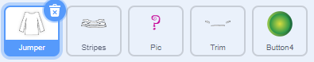
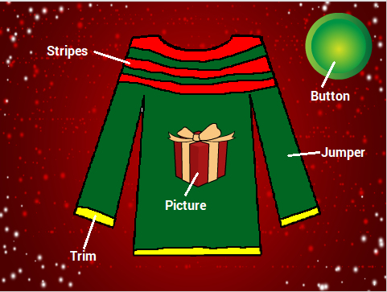
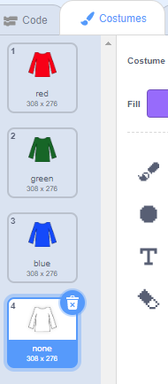

## Parts of the jumper

+ Open the starter project [https://scratch.mit.edu/projects/181128260/#editor](https://scratch.mit.edu/projects/181128260/#editor) - shortlink this!

+ Take a look at the sprites in the project - you have one sprite for each of the four parts which make up the jumper, and a button sprite.

+ Click on the jumper sprite and look at the Costumes tab. You will see three coloured costumes and a white "none" costume.

+ If you like, you can use the fill tool to change the colours of the costumes. Make sure you leave the **none** costume as white.
