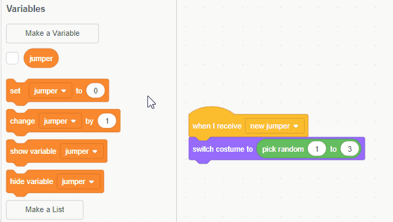

## What was on the jumper?

So far the program creates a random jumper for the player to remember, and then hides it. However, we've made a mistake! We didn't note down anywhere which costumes were randomly chosen, so how will we know if the player has recreated the jumper correctly?

A good way of storing data to use later on is by creating **variables**.

+ Click on the jumper sprite and create a variable (for all sprites) called `jumper`{:class="blockdata"}

[[[generic-scratch-add-variable]]]

Let's save the random costume that was chosen for the jumper inside this variable, so that the program remembers it for later.

+ Set the value of the `jumper`{:class="blockdata"} variable as the green `pick random 1 to 3`{:class="blockoperators"} block to save the number that was chosen.

Then, set the costume to the value of the variable `jumper`{:class="blockdata"}, which now holds the random number.

