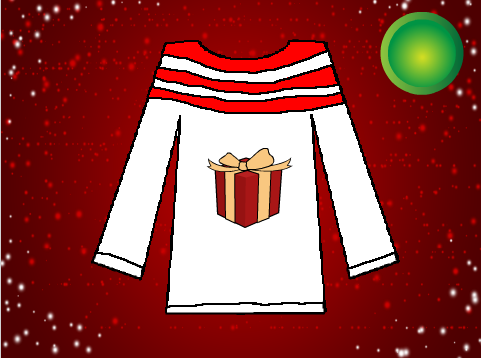

## Recreate the jumper

The player needs to be able to recreate the jumper they saw by clicking on the different parts until they match the original jumper.

+ Switch to the `jumper` sprite.

+ Add some code so that, when the sprite is clicked on, it will display the next available costume.

```blocks
when this sprite clicked
next costume
```

+ Add the same code to all four sprites making up the parts of the jumper.

+ Test your code by waiting for the blank jumper to display, and then clicking on the different parts. Do they change colour each time you click?



--- collapse ---
---
title: My jumper went blank!
---
You might notice that sometimes when you click on the `jumper` sprite, you accidentally drag it a little bit too, and that means it covers up the picture and the stripes. Add the following block at the end to send your jumper behind the other sprites when it is clicked. Then you can always see the other sprites, even if you accidentally drag the sprite.

```blocks
when this sprite clicked
next costume
go back (3) layers
```
--- /collapse ---
