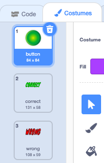

## The right jumper

When the player thinks they have created the jumper, they will click on the button to be told whether they were right or wrong.

+ Click on the **button** sprite and look at its costumes.



The tick and cross costumes will be used to display whether the player's jumper was the same as the one that was displayed at the start.

+ Add some code to the **button** sprite so that when it is clicked it broadcasts a new message called "check"

--- hints ---
--- hint ---
`When this sprite clicked`{:class="blockevents"} it should `broadcast check`{:class="blockevents"}
--- /hint ---
--- hint ---
Here is the code you will need to add to the **button** sprite:

```blocks
when this sprite clicked
broadcast [check v]
```
--- /hint ---
--- /hints ---

When the other sprites hear the message "check", they will each check whether the current `costume number`{:class="blocklooks"} is the same as the costume number saved in the `variable`{:class="blockdata"}.

If the costume numbers do `not`{:class="blockoperators"} match, the sprite will broadcast the message "wrong".

+ Switch to the **jumper** sprite and add some code to check whether the player selected the correct colour. If they were wrong, broadcast "wrong".

```blocks
when I receive [check v]
if <not <(costume #) = (jumper)>> then
broadcast [wrong v]
end
```
